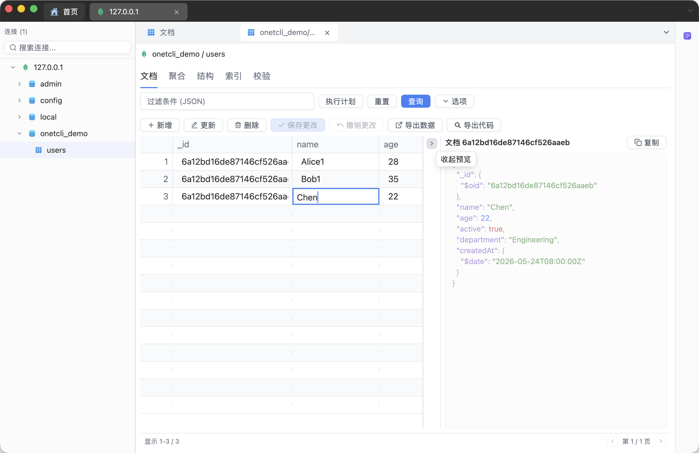

<p align="center">
  
</p>

<h1 align="center">OnetCli</h1>

<p align="center">
  <strong>One</strong> Ne<strong>t</strong> <strong>Cl</strong>ient — A cross-platform desktop client for databases, SSH, terminals & AI, all in one place.
</p>

<p align="center">
  Built with <a href="https://gpui.rs">GPUI</a> · GPU-accelerated · Native performance
</p>

<p align="center">
  <a href="README_CN.md">中文</a> ·
  <a href="#installation">Installation</a> ·
  <a href="https://github.com/feigeCode/onetcli/releases">Releases</a> ·
  <a href="#features">Features</a> ·
  <a href="#screenshots">Screenshots</a> ·
  <a href="CONTRIBUTING.md">Contributing</a>
</p>

---

<!-- Replace with actual screenshot -->
<p align="center">
  
</p>

## Features

**Database Management** — Connect to PostgreSQL, MySQL, SQLite, SQL Server, Oracle, ClickHouse, and DuckDB from a single interface.

**Redis** — Dedicated Redis viewer with key browsing, value inspection, and cluster support.

**MongoDB** — MongoDB explorer with collection browsing, document viewing, and query support.

**SSH, SFTP & Serial** — Integrated SSH terminal, SFTP file manager, and serial connection support in one workspace.

**Terminal** — Built-in local terminal with multi-tab workflows.

**AI Assistant** — Chat with AI directly inside the app. Supports natural language to SQL, query explanation, BI-style data analysis, and chart generation — powered by streaming LLM integration.

**Cloud Sync** — Sync connections and settings across devices with encrypted key storage (AES-GCM, Ed25519).

**Themes & i18n** — Light / dark mode. Supports English, Simplified Chinese, and Traditional Chinese.

## Releases

Build artifacts are published via GitHub Actions on tagged releases (`v*`). See [`CONTRIBUTING.md`](CONTRIBUTING.md) for the release workflow and required secrets.

## Screenshots

| Database | SSH |
|:-:|:-:|
|  |  |

| SFTP | Redis |
|:-:|:-:|
|  |  |

| MongoDB | AI Chat |
|:-:|:-:|
|  |  |

**Built-in Simple Server Monitoring, Native Rendered Charts**


**The terminal comes with an SFTP sidebar that supports file drag-and-drop upload.**    


**Edit files directly from the app, with syntax highlighting and autocomplete.**


**ER Diagram**


Thanks to [ferrum-flow](https://github.com/tu6ge/ferrum-flow.git).

## Platform Support

| Platform | Architecture | Rendering |
|----------|-------------|-----------|
| macOS | aarch64, x86_64 | Metal |
| Linux | x86_64 | Vulkan |
| Windows | x86_64 | — |

### Prerequisites

- Rust (2024 edition)
- Platform-specific dependencies (see below)

### System Dependencies

**macOS / Linux:**

```bash
./script/bootstrap
```

**Windows (PowerShell):**

```powershell
.\script\install-window.ps1
```

### Build & Run

```bash
cargo run -p main
```

### Local Development Environment

The app reads configuration from standard environment variables at runtime, and it can also read Supabase settings from a local config file.

For local development, you can either export variables directly or place a file in the user config directory:

- Windows: `%APPDATA%\one-hub\settings.json`
- macOS / Linux: `~/.config/one-hub/settings.json`

Example file format: `supabase.example.json`

Email template: `docs/supabase-email-otp-template.html`

LLM provider templates:

- `OpenAI` for OpenAI-style APIs (`https://api.openai.com/v1`)
- `OpenAICompatible` for third-party OpenAI-compatible gateways
- `Anthropic` for Anthropic official API (`https://api.anthropic.com`)
- `Ollama` for local Ollama (`http://localhost:11434`)

Logging:

- Set `log_level` in `settings.json` to `info`, `debug`, `warn`, `error`, or `trace`

If you prefer shell variables, copy the example file and load it into your shell:

```bash
cp .env.example .env.local
set -a
. ./.env.local
set +a
```

On PowerShell, you can set the variables in the current session instead:

```powershell
$env:RUST_LOG = "info"
$env:SUPABASE_URL = "https://xxx.supabase.co"
$env:SUPABASE_ANON_KEY = "eyJ..."
$env:ONETCLI_UPDATE_URL = "https://example.com/update"
$env:ONETCLI_UPDATE_DOWNLOAD_URL = "https://example.com/download"
```

### macOS Troubleshooting

If macOS blocks the app from opening after installing the DMG ("Apple cannot check it for malicious software"), run:

```bash
sudo xattr -rd com.apple.quarantine /Applications/OnetCli.app
```

### Oracle Support

Oracle connections require [Oracle Instant Client](https://www.oracle.com/database/technologies/instant-client/downloads.html) (Basic package) to be installed on your system. Download the version matching your platform and ensure the libraries are in your library search path.

## Development

```bash
# Build
cargo build

# Test
cargo test --all

# Lint
cargo clippy -- --deny warnings

# Format check
cargo fmt --check
```

If you need cloud sync or update checks during development, set these variables before launching the app:

- `SUPABASE_URL`
- `SUPABASE_ANON_KEY`
- `ONETCLI_UPDATE_URL`
- `ONETCLI_UPDATE_DOWNLOAD_URL`
- `RUST_LOG`

See [CONTRIBUTING.md](CONTRIBUTING.md) for the full development guide.

## Tech Stack

| Category | Technologies |
|----------|-------------|
| UI Framework | [GPUI](https://gpui.rs) (from Zed editor) |
| Databases | tokio-postgres, mysql_async, rusqlite, tiberius, oracle, clickhouse, redis, mongodb |
| SSH/SFTP | russh, russh-sftp |
| Terminal | alacritty_terminal |
| Text Editing | ropey, tree-sitter, sqlparser |
| AI | llm-connector (streaming) |
| Encryption | aes-gcm, sha2, ed25519 |
| i18n | rust-i18n |

## License

Licensed under [Apache License 2.0](LICENSE-APACHE).

The distribution and use of the OnetCli application are additionally subject to the [OnetCli Supplementary License](ONETCLI_LICENSE), which adds the following restrictions on top of Apache 2.0:

- No redistribution, resale, or repackaging as a standalone product
- No creating competing products or services based on this software
- No hosting on unauthorized distribution platforms

For licensing inquiries, contact xiaofei.hf@gmail.com.


## Star History

<a href="https://www.star-history.com/?repos=feigeCode%2Fonetcli&type=date&logscale=&legend=top-left">
 <picture>
   <source media="(prefers-color-scheme: dark)" srcset="https://api.star-history.com/chart?repos=feigeCode/onetcli&type=date&theme=dark&logscale&legend=top-left" />
   <source media="(prefers-color-scheme: light)" srcset="https://api.star-history.com/chart?repos=feigeCode/onetcli&type=date&logscale&legend=top-left" />
   
 </picture>
</a>
